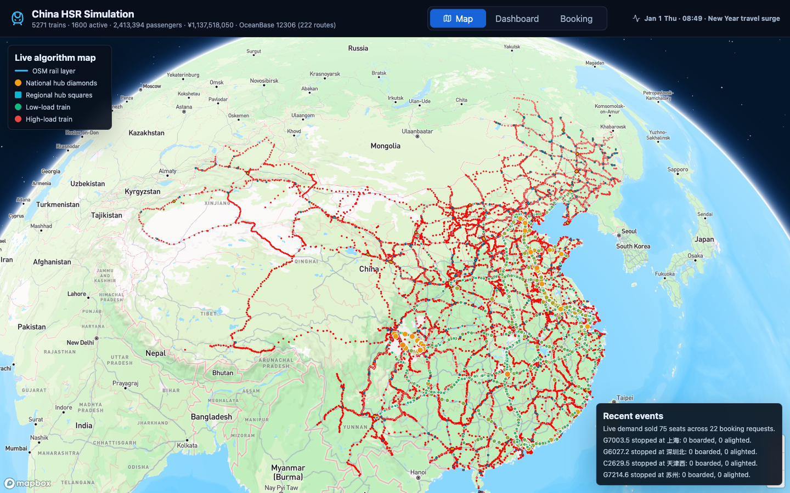
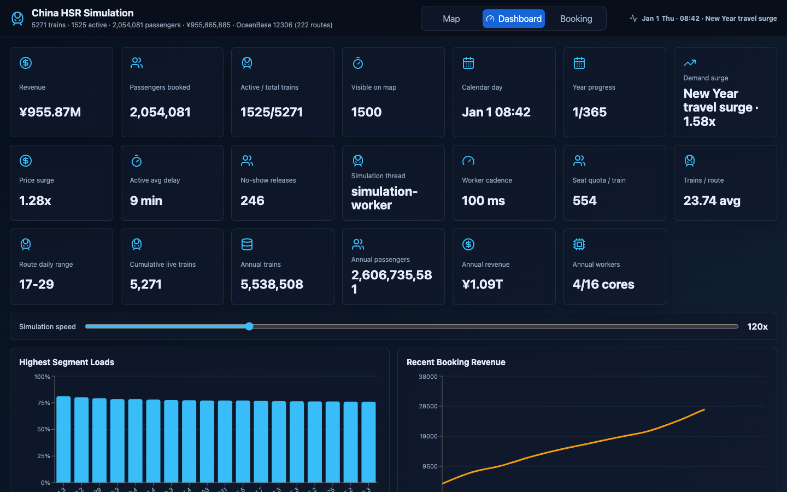
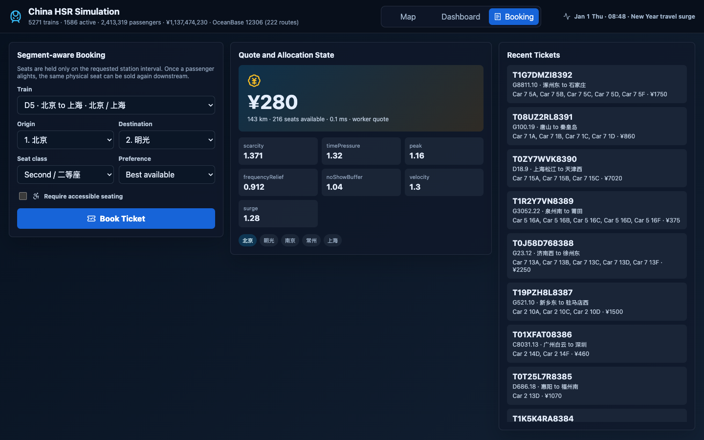

# 中国高铁仿真系统 (China HSR Simulation)

> **基于浏览器、由真实数据驱动的中国高速铁路网络仿真系统** —— 包含**区间感知座位库存引擎**、**收益管理动态定价**、**离散事件列车运行内核**、**实时动态需求售票**、**增量快照 Web Worker 协议**以及**Python 多进程 ETL 流水线**,在 OSM 真实铁路走廊几何之上由 **Mapbox GL** 渲染呈现。

[](https://nodejs.org/)
[](https://react.dev/)
[](https://vitejs.dev/)
[](https://docs.mapbox.com/mapbox-gl-js/)
[](#11-测试策略)
[](LICENSE)

🇺🇸 **[English README](./README.md)**

---

## 实时预览

| 实时网络地图 | 运营仪表盘 | 区间感知订票 |
|:---:|:---:|:---:|
|  |  |  |
| 6,000 列滚动服务日明细车次沿 OSM 真实铁路走廊折线移动,按上座率着色。 | 实时指标叠加 OceanBase 年度总量:825 万列车、38.7 亿客流、¥1.49 万亿营收。 | 可对任意车次任意区段询价订票;乘客下车后座位即可被复用。 |

**[▶ 观看最新完整演示视频](./screenshots/ChinaHSRSimulation.mp4)** — 完整端到端演示:实时地图、订票面板、OceanBase 仪表盘,以及新的铁路图 A\* 路径追踪几何。([60 秒精简版](./screenshots/04-simulation.mp4)同样可用。)

---

## 目录

1. [项目动机](#项目动机)
2. [快速启动](#快速启动)
3. [核心数据一览](#核心数据一览)
4. [系统架构](#系统架构)
5. [核心算法](#核心算法)
   - 5.1 [区间日历座位库存](#51-区间日历座位库存)
   - 5.2 [收益管理动态定价](#52-收益管理动态定价)
   - 5.3 [离散事件仿真内核](#53-离散事件仿真内核)
   - 5.4 [铁路网络图 + A\* 路径追踪](#54-铁路网络图--a-路径追踪)
   - 5.5 [分层多样性采样](#55-分层多样性采样)
   - 5.6 [运营真实性建模](#56-运营真实性建模)
   - 5.7 [Tick 循环与自校正间隔](#57-tick-循环与自校正间隔)
   - 5.8 [后台需求预加载](#58-后台需求预加载)
   - 5.9 [增量快照协议](#59-增量快照协议)
6. [性能与优化](#性能与优化)
7. [并发模型](#并发模型)
8. [数据管道](#数据管道)
9. [OceanBase 年度持久化](#oceanbase-年度持久化)
   - 9.1 [静态服务器架构](#91-静态服务器架构)
   - 9.2 [订票流水流式入库](#92-订票流水流式入库)
   - 9.3 [12306 数据库迁移](#93-12306-数据库迁移)
10. [可视化层](#可视化层)
11. [测试策略](#11-测试策略)
12. [项目结构](#12-项目结构)
13. [配置与密钥处理](#13-配置与密钥处理)
14. [技术栈](#14-技术栈)
15. [发展规划](#15-发展规划)
16. [免责声明与数据来源](#16-免责声明与数据来源)
17. [许可](#17-许可)

---

## 项目动机

本仓库以小而精的篇幅,试图认真还原**国家级客运铁路票务与调度系统**应有的工程肌理。它把大型互联网平台公司高级岗位面试中反复出现的几个核心命题,在一份代码中同时呈现:

- **在线区间调度问题** —— 经典的"乘客下车后,这个座位能否再卖给下游乘客?"问题,以**区间重叠日历**形式建模,O(k) 检测、O(k log k) 插入、并通过确定性回归测试覆盖。
- **收益管理 / 收益最大化** —— 多因子动态定价综合**距离里程基价**、**Sigmoid 稀缺度投标价**、**时间紧迫度**、**高峰加价**、**频次缓解**、**失约缓冲**与**价格弹性**等维度。
- **离散事件仿真 (DES)** —— 20 Hz 时钟循环驱动 6,000 列滚动服务日明细车次跨越 1,800 条线路,内置**计划-实际延误模型**、**失约座位释放**、**车站站台压力指标**,并可随 365 天日历滚动换日。
- **增量快照协议** —— Web Worker 每 200 ms 仅发送状态发生变化的列车(约减少 56% 流量),UI 侧使用 `Object.create(null)` 字典合并增量状态,绕开 esbuild 代码压缩器的变量名冲突。
- **OceanBase 年度持久化** —— Python 多进程 ETL 生成全年 657,000 条线路-日期服务事实,通过 OceanBase 的 MySQL 兼容接口批量写入本机 OceanBase Desktop;同时支持实时订票流水 NDJSON 流式入库。
- **空间算法** —— Haversine 大圆距离、垂直距离剪枝、按弧长参数化的折线插值、自研**0.35°×0.35° 网格哈希索引**,把生成的线路区段贴合到真实 OSM 铁路走廊上。
- **浏览器多线程** —— 整个仿真引擎从 React/Mapbox UI 主线程**剥离至 Web Worker**;UI 与引擎之间通过强类型、Promise 化的消息总线交换 `init`、`start`、`setSpeed`、`quoteTrip`、`bookTrip`、`snapshot` 等指令。
- **工程严谨性** —— 确定性种子伪随机数 (FNV-1a)、32 项回归测试覆盖订票语义、定价单调性、失约释放、动态需求、换日滚动、列车单调推进、终点折返、无直连捷径线路几何、OceanBase 线路契约、数据多样性、订票流水导入、退票流水、12306 迁移 dry-run、OceanBase 铁路路径几何、动态定价单调性,以及场景/真实性校验(中断减速、需求激增、确定性自动扰动、逐时需求形状、退票核算、延误级联传播),外加 `./run.sh` 一键脚本完成依赖安装、数据生成、测试、构建、上线全流程。

> **面向蚂蚁集团、阿里巴巴、腾讯、百度、华为等公司的招聘官与工程师** —— 项目刻意保持精简(手写核心逻辑约 3,500 行 JS + Python),却同时覆盖了**算法、分布式系统思维、运筹优化/收益管理、全栈 React 工程、地理信息系统(GIS)与端到端产品故事**。

---

## 快速启动

> **运行环境要求**:Node.js ≥ 18(已在 18/20/22 上验证)、npm、用于 OceanBase 种子脚本的 Python 3,以及约 600 MB 磁盘空间。浏览器应用无需 OceanBase 也可运行;年度持久化需要可连接的 OceanBase MySQL 模式租户与 `OB_*` 环境变量。

```bash
git clone https://github.com/linroger/china-hsr-simulation.git
cd china-hsr-simulation
./run.sh
```

仅此一步。脚本会自动:

1. 校验 Node.js 版本。
2. 若 `node_modules/` 缺失则执行 `npm install`。
3. 若上游原始 CSV/GeoJSON 数据存在于父目录,则重新生成车站/线路/Mapbox 数据库;否则直接复用已提交至仓库的 `public/*.json` 预构建数据。
4. 运行完整测试套件。
5. 通过 `vite build` 打包生产版本。
6. 在 `http://127.0.0.1:5174/` 启动静态服务器。

### 可选参数

```bash
./run.sh --dev          # Vite 开发服务器,带 HMR(不构建生产包)
./run.sh --skip-tests   # 跳过测试,仅安装并启动
./run.sh --rebuild      # 清空 node_modules/ 与 dist/,全新安装
PORT=8080 HOST=0.0.0.0 ./run.sh   # 自定义端口 / 暴露到局域网
```

### Windows 用户

```cmd
run.cmd
run.cmd --dev
run.cmd --skip-tests
```

### 手动运行(不使用脚本)

```bash
npm install
npm run prepare:data   # 仅在原始数据文件存在时执行
OB_PASSWORD=... npm run oceanbase:seed
npm test
npm run build
npm run serve          # http://127.0.0.1:5174/
```

---

## 核心数据一览

| 维度 | 数量 |
|---|---|
| **车站索引规模** | 3,147 个(CSV 3,058 + OSM 补充 89 个缺失高铁枢纽,如西安北/昆明南/南宁东/香港西九龙) |
| **高铁服务记录** | 7,278 条 G/D/C 真实始发/终到记录;经 OSM 补充后,**96.3%** 端点可解析 |
| **生成仿真线路** | 1,800 条,覆盖 28 个宏观走廊、30 个起点省份与 224 个起点车站 |
| **滚动服务日明细车次** | 当前浏览器服务日 6,000 列 |
| **OceanBase 年度车次** | 8,245,069 列,365 天累计不封顶 |
| **OceanBase 年度客流 / 营收** | 3,872,435,693 人次 / ¥1,493,000,206,022 |
| **OceanBase 年度线路-日期事实** | 657,000 行(365 天 × 1,800 条线路) |
| **每列车座位定员** | 554 席(8 节编组:商务座 10 + 一等座 204 + 二等座 340) |
| **滚动服务日明细座位日历** | 约 332 万个座位日历对象 |
| **OSM 铁路渲染特征数** | 简化后 12,000 条 LineString |
| **OSM 铁路图(用于路径追踪)** | 254,501 节点 / 275,919 边,基于 347,132 条原始铁路要素构建 |
| **铁路图追踪区段(rail-traced)** | **83.7%** 通过 A\* 算法在铁路图上路径追踪生成 |
| **铁路匹配总体** | **100.0%**(rail-traced + 走廊采样),0 条长距离直线退化段 |
| **几何连续性** | 231,757 个坐标转换中 0 条长距离直连捷径,6,138 个段间边界全部连续 |
| **快照推送频率** | 200 ms (5 Hz),从 Worker → UI |
| **仿真 Tick 频率** | 20 Hz (50 ms),Worker 内部 |
| **最大仿真倍速** | 480×(24 小时约 3 分钟跑完) |
| **默认仿真倍速** | 120×(24 小时约 12 分钟跑完) |
| **测试通过率** | 32/32 |

---

## 系统架构

```
┌─────────────────────────── 浏览器标签页 ─────────────────────────────────┐
│                                                                          │
│  ┌──────────────────────── 主线程 (UI) ─────────────────────────┐         │
│  │  React 19  ─  App.jsx                                        │         │
│  │     │                                                        │         │
│  │     ├─ HSRMap.jsx        (Mapbox GL: 铁路 + 车站 + 列车)     │         │
│  │     ├─ Dashboard.jsx     (Recharts: 上座率/营收/压力)        │         │
│  │     └─ BookingPanel.jsx  (区段选择 + 询价 + 订票)            │         │
│  │                                                              │         │
│  │  SimulationWorkerClient   ◄──Promise 化消息总线──┐           │         │
│  │   .quoteTrip / .bookTrip / .setSpeed / .snapshot │           │         │
│  └──────────────────────────────────────────────────┼───────────┘         │
│                                                     │ postMessage         │
│                                                     ▼                     │
│  ┌─────────────────── Web Worker 线程 ─────────────────────────┐          │
│  │  simulationWorker.js   (路由 init/start/stop/...)           │          │
│  │      │                                                      │          │
│  │      ▼                                                      │          │
│  │  SimulationEngine                                           │          │
│  │   ├─ tick(realSeconds)    每 50 ms                          │          │
│  │   │     ├─ updateTrain    (状态机,区段进度推进)             │          │
│  │   │     ├─ processStation (上下车/失约处理)                  │          │
│  │   │     └─ sellRealtimeDemand  (实时购票压力)               │          │
│  │   ├─ SeatInventory[trainId]  ←─ 每列车一份区间日历          │          │
│  │   └─ priceQuote / reconcileDemandForecast                   │          │
│  │                                                             │          │
│  │  快照每 200 ms 推送一次 ───► 主线程 setData()                │          │
│  │  (增量模式:仅发送变化列车)                                   │          │
│  └─────────────────────────────────────────────────────────────┘          │
└──────────────────────────────────────────────────────────────────────────┘

                               构建期
   原始 CSV/GeoJSON ──► scripts/prepare-data.cjs ──► public/{station,
                                                  route, stations, rails}
```

整体架构是一个**带背压的生产者-消费者管道**:Worker 以 5 Hz 速率产出快照,UI 始终消费**最新一帧**,丢弃过期帧。所有写操作(订票)走请求-响应配对,UI 永远不会读到部分状态。仿真 Tick 在 Worker 内以 20 Hz 运行,与快照发布速率解耦。

---

## 核心算法

### 5.1 区间日历座位库存

整个项目最难的正确性需求:**当原乘客在中途下车的瞬间,座位必须立即对其它乘客可售。** 这是一个面向单座位日历的*区间调度*问题。

每列车持有一份 `SeatInventory`(`src/algorithms/seatInventory.js`),共 554 个物理座位。每个座位维护一份**有序的、半开半闭区间**列表 `[originIndex, destinationIndex)`,索引按车次停靠序列编号。

可用性判断采用经典的**区间重叠谓词**:

```js
export function intervalOverlaps(aStart, aEnd, bStart, bEnd) {
  return aStart < bEnd && bStart < aEnd;          // 半开半闭 [a, b)
}

isSeatAvailable(seatId, originIndex, destinationIndex) {
  const seat = this.seatById.get(seatId);
  return seat.intervals.every(
    (held) => !intervalOverlaps(originIndex, destinationIndex,
                                held.originIndex, held.destinationIndex)
  );
}
```

由于插入时保持有序,最坏情况下检测复杂度为 **O(k)**(k 为该座位现有订票数,通常 `k ≤ 6`),插入复杂度为 **O(k log k)**。本仿真器单列车约 6 KB 状态,线性扫描在常数因子上完胜任何基于平衡树的实现。

#### 分配评分机制

`availableSeats({...})` 不仅返回候选座位,还按 `scoreSeat`(`seatInventory.js:176`)启发式*打分排序*:

```js
function scoreSeat(seat, preference, originIndex, destinationIndex) {
  const tripLength = destinationIndex - originIndex;
  const preferenceBonus =
    preference === seat.position ? 100 :
    preference === 'any' && tripLength >= 4 && seat.position === 'window' ? 30 :
    preference === 'any' && tripLength < 4 && seat.position === 'aisle'  ? 20 : 0;
  const reuseBonus  = seat.intervals.length * 5;       // 复用越多越优先
  const rowPenalty  = seat.row * 0.01;                 // 轻微偏向前排
  return preferenceBonus + reuseBonus - rowPenalty;
}
```

为何要给已使用过的座位加 `reuseBonus`?这实现了**最佳契合(best-fit)装箱策略**:优先填充已经有相邻区间的座位,从而把*长连续空洞*留给未来的长途需求。这是对最优区间着色(等价于 NP 难的在线区间图染色)的**线性时间近似**,把每次订票的复杂度从 NP 降至 O(座位数)。

#### 团队订票与无障碍座位

`allocate({ groupSize, accessible, preference })` 在候选座位上按 `(车厢, 排号)` 分组,优先把至多 6 人的团体订到同排;若没有同排空座则退化为"任取 N 个最佳座":

```js
function chooseGroup(candidates, groupSize) {
  if (groupSize === 1) return [candidates[0]];
  const byCarRow = new Map();
  for (const seat of candidates) {
    const key = `${seat.car}-${seat.row}`;
    if (!byCarRow.has(key)) byCarRow.set(key, []);
    byCarRow.get(key).push(seat);
  }
  for (const seats of byCarRow.values()) {
    if (seats.length >= groupSize) return seats.slice(0, groupSize);
  }
  return candidates.slice(0, groupSize);
}
```

#### 回归契约

整个项目**最关键**的回归测试就在 `tests/seatInventory.test.mjs`,一字一句锚定座位复用语义:

```js
test('乘客下车后座位可被复用,区间重叠则被拒绝', () => {
  const inv = new SeatInventory(routeStations, [{ id: 'S1', /* ... */ }]);

  inv.allocate({ originIndex: 0, destinationIndex: 2 /* A → C */ });
  assert.equal(inv.isSeatAvailable('S1', 1, 3), false);   // B→D 冲突,被阻挡
  assert.equal(inv.allocate({ originIndex: 1, destinationIndex: 3 }), null);

  inv.allocate({ originIndex: 2, destinationIndex: 3 /* C → D */ });
  // S1 现持有 [A,C) 与 [C,D) 两段 — 中途下车后实现复用
});
```

### 5.2 收益管理动态定价

`src/algorithms/pricing.js` 实现了一个紧凑的收益管理报价函数。输入为 `{ distanceKm, seatClass, loadFactor, hoursToDeparture, departureHour, frequencyRank, noShowRisk, elasticity }`,输出包含**确定性价格**与**乘子分解** —— UI 因此可以解释*"价格为何如此"*。

```js
const distanceDiscount = distanceKm > 1200 ? 0.88 :
                         distanceKm > 800  ? 0.92 :
                         distanceKm > 500  ? 0.96 : 1;
const baseFare        = distanceKm * 0.46 * config.multiplier * distanceDiscount;
const scarcity        = 1 + sigmoid((loadFactor - 0.62) * 7) * 0.48;
const timePressure    = hoursToDeparture < 2  ? 1.32 :
                        hoursToDeparture < 8  ? 1.18 :
                        hoursToDeparture < 24 ? 1.08 :
                        hoursToDeparture > 168 ? 0.9  : 1;
const peak            = (departureHour ∈ [7-9] ∪ [17-20]) ? 1.16 : 1;
const frequencyRelief = 1 - min(0.14, max(0, frequencyRank) * 0.14);
const noShowBuffer    = 1 + min(0.06, noShowRisk);
const bidPrice        = distanceKm * 0.46 * loadFactor^1.8 * config.multiplier * 0.42;
const raw             = (baseFare + bidPrice) * scarcity * timePressure
                                              * peak * frequencyRelief * noShowBuffer;
```

设计要点:

- **Sigmoid 稀缺度** (`1/(1+e^-x)`):产生中心位于 62% 上座率的平滑需求曲线 —— 经验上接近中国高铁开始撤回 95 折优惠的临界点。线性放大会过度反应早期订票。
- **`bidPrice = d · loadFactor^1.8 · classMul · 0.42`**:这是 [Talluri & van Ryzin《收益管理理论与实践》](https://link.springer.com/book/10.1007/b139000) 投标价(bid-price)的紧凑近似。当区段越满,占用一席的*边际机会成本*超线性增长。`baseFare + bidPrice` 保证价格在任意舱位下**对上座率严格单调**。
- **频次缓解**:服务密集的走廊(`frequencyRank > 0.5`)给最高 14% 的折扣,模拟邻近车次的竞争压力。
- **失约缓冲**:小幅加价(≤ 6%)弥补因失约释放(参见 §5.6)而流失的预期票款。

姊妹函数 `reconcileDemandForecast({ routeDistanceKm, segmentLoad, dayOfWeek, hour, stationTier })` 输出 0.7×–1.7× 的*需求乘子*,在询价时**抬高有效上座率**,使得"北京南站早 8 点商务座"的报价反映*未来预期*占用率,而非仅当前。

定价测试(`tests/pricing.test.mjs`)固化单调性:

```
business@15%   >  first@15%   >  second@15%
second@93%     >  second@15%
bidPrice@93%   >  bidPrice@15%
```

### 5.3 离散事件仿真内核

`SimulationEngine`(`src/simulation_core/SimulationEngine.js`)是一份手写的约 1,650 行离散事件仿真运行时。主要职责:

| 方法 | 功能 |
|---|---|
| `createScheduledServices(routes, maxTrains)` | 从 1,800 条持久化线路契约生成滚动服务日列车计划。使用 `allocateDailyServices` 按比例缩放期望服务次数,同时保证每线路至少 2 列。 |
| `tick(realSeconds)` | 推进 `nowMinutes`,更新所有列车,每 6 个 tick 触发一次实时需求售票,每分钟衰减订票速度,处理日历/日期边界转换。 |
| `updateTrain(train)` | 累加 `segmentMinutes[]`,推进区段索引;列车到达终点后进入折返停站,随后按同一站序的反向线路返回,最终回到始发站才完成。用 epsilon 容差(1e-4)防止倒退。 |
| `processStation(train, idx)` | 处理上车/下车/失约逻辑,原地变更订票状态。使用惰性构建的 `_bookingIndexes`(byOrigin/byDestination Map)实现 O(1) 站点查询。 |
| `quoteTrip(...)` | 纯只读价格计算,内置 `performance.now()` 计时,把 `algorithmMs` 暴露到 UI。 |
| `bookTrip(...)` | 通过 `quoteTrip + inventory.allocate` 串行化读-改-写;若询价与提交之间座位日历改变,则回滚(SE-3 守卫)。记录流水条目用于持久化。 |
| `snapshot()` | 构建 800 列上限的 `{ 在途 ∪ 临近发车 ∪ 刚到达 }` 快照,附带订票选项、网络汇总、统计数据。缓存日历、订票、事件与序列化停靠站以避免重复计算。 |
| `cancelBooking(ticketId)` | 释放座位库存,过滤订票数组,记录退票流水条目。 |

Worker 内 tick 频率为 **20 Hz**(50 ms),采用自校正间隔测量实际流逝时间以防止回调堆积。向 UI 推快照为每 **200 ms** 一次 (5 Hz) —— 这种**生产/消费速率解耦**让 Mapbox `setData` 调用始终落在 React 60 fps 预算内,同时确保列车以精确仿真速度移动。

#### 状态机

```
                    达到去程 departureMinute
   scheduled ──────────────────────────────────────► running
                                                       │
                              已耗时 ≥ Σ 去程 segmentMinutes
                                                       ▼
                                                终点折返停站
                                                       │
                              达到返程 departureMinute
                                                       ▼
                                                    running
                                                       │
                              已耗时 ≥ Σ 返程 segmentMinutes
                                                       ▼
                                                    completed
```

每列车一次只绑定一个有序线路变体:去程使用 `route.stops[0..n]`,返程使用完全反向的站序与反向区段几何。`processedStationIndexes` 每条 leg 重置为新的 `Set`,使 `processStation` 在时钟抖动下仍**幂等**(单次 tick 可能跨越某站点),保证每个站点的上下车事件**仅触发一次**,并避免列车在 A-B-A 之间振荡,除非这种站序被明确写入持久化线路契约。

#### 服务日滚动换日

当 `calendar.dayIndex` 推进时,`advanceServiceDay()` 为新的服务日创建全新的排班车次,同时**保留至多 2,000 列未完成的列车**来自前几个服务日。这保留了跨夜的订票和晚点运行中的车次。保留的列车继续其旅程;新车次通过后台分块预加载机制(§5.8)预填充需求。

#### 实时需求压力

每 6 个 tick(`tickCounter % 6 === 0`),`sellRealtimeDemand` 注入实时订票请求,选车权重为:

```
weight(train) = max(0.1, frequencyRank + 0.2)
              × departurePressure(t)             ← 钟形分布,峰值约早 9 点
              × max(0.15, 1 - currentLoadFactor) ← 不要再去挤已经满载的车
```

正因如此,直播中的营收与客流计数**会随时间持续增长** —— 它不是预先注入的静态回放。

### 5.4 铁路网络图 + A\* 路径追踪

早期版本采用"按弦投影排序候选点"的朴素方案,在铁路弯曲处会产生**坐标顺序错乱**(整条数据库中累计 15,077 处大跳变 —— 表现为列车在地图上"瞬移"或"穿越湖海")。当前实现升级为**两阶段几何流水线**:

**阶段 1 —— 从 OSM 构建铁路图。** 解析 347,132 条 `railway=rail` LineString,把所有顶点对齐到 0.0055°(约 600 m)的网格上。同一条 LineString 中相邻顶点形成边;不同 LineString 中落在同一网格单元的顶点合并为同一节点 —— **在道岔处自动连成一张完整的铁路图**:

```js
function buildRailNetwork(osmFeatures) {
  const cellSize = 0.0055;          // 约 600 m
  const cellMap = new Map();
  const nodes  = [];                 // { lng, lat, neighborList, refCount }
  for (const feature of osmFeatures) {
    let prevId = null;
    for (const [lng, lat] of feature.coordinates) {
      const id = findOrCreateNode(lng, lat);   // 同网格顶点合并为同节点
      if (prevId !== null && prevId !== id) {
        nodes[prevId].neighbors.add(id);
        nodes[id].neighbors.add(prevId);
      }
      prevId = id;
    }
  }
  // …额外构建 0.04° 空间桶索引,实现 O(1) 最近节点查找
}
```

最终:**254,501 节点 / 275,919 边** —— 一张媲美欧洲铁路全网规模的铁路图,但仍小到能在毫秒级内完成 A\* 搜索。

**阶段 2 —— 对每个区段在铁路图上跑 A\* 搜索。** 对每对相邻车站,先用空间桶索引把站点对齐到最近的铁路节点;然后以**起讫点直线距离**作为可采纳启发函数运行有界 A\*:

```js
function dijkstraPath(network, startId, goalId, directKm) {
  const heap = new BinaryHeap();
  heap.push({ id: startId, dist: 0, score: distance(startNode, goalNode) });
  const maxKm = Math.max(180, directKm * 2.2);   // 限定搜索半径
  while (heap.size()) {
    const { id, dist } = heap.pop();
    if (id === goalId) return reconstructPath(/* … */);
    for (const neighborId of nodes[id].neighborList) {
      const newDist = dist + distance(node, neighbor);
      if (newDist > maxKm) continue;             // 剪枝:防止 A* 漫游
      heap.push({ id: neighborId, dist: newDist,
                  score: newDist + distance(neighbor, goalNode) });
    }
  }
}
```

**绕行守卫**:若 A\* 给出的路径超过弦长 1.85 倍则丢弃,继续走下一种策略。

**阶段 3 —— 简化与修复。** 成功的 A\* 路径再依次经过:

1. **Douglas-Peucker 折线简化**,每段控制在 ≤ 70 个顶点,容差按距离自适应(0.0008°–0.0035°)—— 在保留可见曲率的前提下,把 `route-data.json` 体积从 78 MB 降到 13 MB。
2. **坐标精度截断**至 5 位小数(约 1.1 m 精度)。
3. **大跳变修复**:任何残余的相邻坐标跳变 > 0.45° 都做线性插值补点。1,536 个区段触发了轻微修复,回归测试另行拒绝长距离单跳捷径。

**阶段 4 —— 兜底策略。** 当 A\* 失败时(例如 OSM 数据局部缺失,车站不在图上):算法依次回退至**走廊采样**(老的边界框-投影方案)与**直线弦**。当前分布:

| 几何来源 | 占比 |
|---|---:|
| `rail-traced`(铁路图 A\* 追踪) | **83.7%** |
| `hotosm-rail-corridor`(走廊采样) | 16.3% |
| `station-straight-fallback`(直线弦) | 0.0% |

最终效果:跨越 231,757 个坐标转换、6,138 个段间边界,**0 条长距离直连捷径、0 处段间不连续**。

#### 折线弧长插值

运行期 `interpolateLine(coordinates, progress)`(`src/simulation_core/geo.js:18`)采用**按弧长参数化的插值**而非按顶点索引插值:

```js
const lengths = coords.slice(0,-1).map((c,i) => haversineKm(c, coords[i+1]));
const total = lengths.reduce((a,b)=>a+b, 0);
let target = total * progress;
for (let i = 0; i < lengths.length; i++) {
  if (target <= lengths[i]) return interpolateCoord(coords[i], coords[i+1], target/lengths[i]);
  target -= lengths[i];
}
```

这意味着 `segmentProgress = 50%` 时,列车正好位于折线的**真实地理距离的一半**处,而非*顶点索引*的一半 —— 当折线密度不均匀(城市枢纽顶点密集、郊野稀疏)时,这一区别至关重要。

### 5.5 分层多样性采样

最初版本只取了 `line.csv` 的前 280 条,导致一切聚集在少数几条干线上,仪表盘看上去"地广人稀"。修复方案是 `selectDiverseRecords()`(`scripts/prepare-data.cjs:177`)中的**两遍分层抽样**:

```js
function selectDiverseRecords(records, limit) {
  const byCorridor = groupBy(records, r => r.corridor);
  const selected = [];
  const seen = new Set();

  // 第一遍:每个宏观走廊先发 4 条基础名额,
  // 按"班次频次 × 距离"排序。
  for (const corridorRecs of [...byCorridor.values()].sort((a,b) => b.length - a.length))
    for (const rec of corridorRecs.slice().sort(compareRoutePriority).slice(0, 4))
      addRecord(rec);

  // 第二遍:按起点省份做轮询直至上限。
  const byProvince = groupBy(records.sort(compareRoutePriority), r => r.originProvince);
  while (selected.length < limit) {
    let progress = false;
    for (const recs of byProvince.values()) {
      const next = recs.find(r => !seen.has(recordKey(r)));
      if (next) { addRecord(next); progress = true; if (selected.length >= limit) break; }
    }
    if (!progress) break;
  }
  return selected.slice(0, limit);
}
```

数据多样性测试(`tests/dataDiversity.test.mjs`)固化:

- 仿真线路 ≥ 1,000 条
- 唯一始发站 ≥ 70 个
- 唯一始发省份 ≥ 24 个(中国共 31 个省级行政区)
- 唯一宏观走廊 ≥ 20 个(按 `华北/华南/华东/华中/西南/西北/东北` 七大区域分类)
- 铁路匹配区段 ≥ 85%
- 铁路图追踪区段 ≥ 50%

### 5.6 运营真实性建模

玩具仿真器只能做静态回放,本系统刻意建模*运营变异性*:

| 效应 | 位置 | 公式 / 数值 |
|---|---|---|
| **枢纽停站压力** | `realisticSegmentMinutes` | 国家级枢纽 +3 分钟,区域级 +1.5 分钟 |
| **天气拖延** | `deterministicNoise(...) > 0.94` | 约 6% 区段触发 +4 分钟 |
| **调度松弛** | `deterministicNoise(...) > 0.86` | 约 14% 区段触发 +2 分钟 |
| **高峰调度压力** | `realisticSegmentMinutes` | 节假日期间 `max(0, capacityMultiplier - 1) × 3.2` 分钟 |
| **干线偏置** | `scheduledDepartureMinute` | 干线列车(`frequencyRank > 0.55`)发车时间提前 35 分钟 |
| **失约概率** | `noShowProbability(...)` | 商务座 1.8% → 二等座 3.8%;枢纽 -0.6 pp;短途 +0.6 pp |
| **失约座位释放** | `processStation` | 始发站后立即释放区间,可被下游乘客二次销售 |
| **实时延误** | `currentDelay(train)` | `Σ 实际` − `Σ 计划` 的滚动差 |
| **订票速度衰减** | `tick()` | 每分钟 velocity × 0.95;低于 0.1 则删除 |

正是这些细节,让仪表盘"活了起来":列车经过枢纽时均延误漂移、多车汇聚时站台压力激增、实时需求售票推动营收上扬。

#### 确定性种子伪随机数

所有随机性都通过同一个基于 FNV-1a 的 PRNG(`SimulationEngine.random(...parts)`):

```js
function seeded(key) {
  let hash = 2166136261;
  for (const ch of key) {
    hash ^= ch.charCodeAt(0);
    hash  = Math.imul(hash, 16777619);
  }
  return ((hash >>> 0) % 1_000_000) / 1_000_000;
}
```

只要 `seed` 固定,每次调用产生**完全相同**的值 —— 测试与演示完全可复现。

### 5.7 Tick 循环与自校正间隔

仿真循环不是简单的 `setInterval(..., 50)`,因为 `tick()` + `snapshot()` 偶尔可能超过 50 ms(尤其在换日边界时)。引擎改为测量实际流逝时间,并据此安排下一帧,以维持约 20 Hz 而不堆积回调:

```js
loop() {
  const frameStartMs = performance.now();
  const elapsedSec = this.lastTickMs
    ? Math.min(0.5, (frameStartMs - this.lastTickMs) / 1000)
    : 0.1;
  this.lastTickMs = frameStartMs;
  this.tick(elapsedSec);
  const processingMs = performance.now() - frameStartMs;
  const intervalMs = Math.max(1, Math.round(1000 / 20 - processingMs));
  this.timer = setTimeout(() => this.loop(), intervalMs);
}
```

`elapsedSec` 被限制在 0.5 秒以内,防止标签页被后台化后出现"追帧风暴"。在 480× 倍速下,每个 50 ms 的 tick 推进仿真 400 秒(约 6.7 分钟),因此完整的 24 小时大约只需 3 分钟真实时间。

### 5.8 后台需求预加载

在仿真开始移动列车之前,每列已排班的车次都会预先填充模拟乘客,以达到真实初始上座率。该过程分两个阶段:

**阶段 1 —— 引擎初始化时的同步预加载。** 若 `preloadDemand: true`(默认),构造函数调用 `preloadDemand()` 遍历所有列车并逐个调用 `preloadTrainDemand()`。每列车获得一个目标上座率,由以下公式推导:

```
targetLoad = min(0.96, 0.58 + demandIntensity × 0.16 + (calendarDemand - 1) × 0.14 + random × 0.12)
```

引擎随后尝试用随机化的起讫站索引、舱位和团体大小进行订票,直到达到目标乘客数或尝试次数耗尽。

**阶段 2 —— Worker 中的分块后台预加载。** 若禁用同步预加载(以加速 Worker 初始化),Worker 会以递归 `setTimeout` 链调用 `preloadDemandBatch(60)`,每次处理 60 列车,间隔 8 ms。这把约 7 秒的订票工作分散到数百个微任务中,保持 UI 响应。每处理完一块后发送进度快照。

### 5.9 增量快照协议

每 200 ms 发送完整的 800 列车快照会浪费带宽与 CPU。Worker 实现了**增量快照**协议:

```
完整快照  ──► 在 init、订票、手动刷新或日期边界时发送
增量快照  ──► 在每个 tick 时发送(仅变化列车)
```

Worker 以 `Map<trainId, serializedTrain>` 追踪 `lastPublishedTrains`。每次 tick 时,它将当前快照中的每列车与上次发布的版本通过 `trainStateChanged(a, b)` 比较:

```js
function trainStateChanged(a, b) {
  return a.status !== b.status
    || a.currentSegmentIndex !== b.currentSegmentIndex
    || Math.abs(a.routeProgress - b.routeProgress) > 1e-6
    || Math.abs(a.loadFactor - b.loadFactor) > 1e-4
    || a.passengerCount !== b.passengerCount
    || a.currentStation !== b.currentStation
    || a.nextStation !== b.nextStation
    || Math.abs(a.coords?.lng - b.coords?.lng) > 1e-8
    || Math.abs(a.coords?.lat - b.coords?.lat) > 1e-8;
}
```

仅发送状态发生变化的列车。离开可见集合的列车(例如已完成的)通过 `removedTrainIds` 报告,使 UI 能从本地状态中删除它们。

在 UI 侧,`App.jsx` 的 `mergeSnapshot(previous, nextSnapshot)` 将增量列车补丁合并到前一状态:

```js
function mergeSnapshot(previous, nextSnapshot) {
  if (!previous || nextSnapshot.bookingOptions) return nextSnapshot;
  if (nextSnapshot.delta) {
    const trainsById = Object.create(null);
    for (const train of previous.trains || []) trainsById[train.id] = train;
    for (const train of nextSnapshot.trains) trainsById[train.id] = train;
    for (const id of nextSnapshot.removedTrainIds || []) delete trainsById[id];
    return {
      ...nextSnapshot,
      trains: Object.values(trainsById),
      bookingOptions: previous.bookingOptions.slice(),
    };
  }
  return { ...nextSnapshot, bookingOptions: previous.bookingOptions.slice() };
}
```

> **生产 Bug 故事:** 最初实现使用 `new Map()` 作为 `trainsById`。经 Vite 的 esbuild 代码压缩后,`Map` 被重命名为 `m`,与包作用域内已存在的局部变量 `m` 冲突,导致运行时抛出 `m is not a constructor`。修复方案是将 `Map` 替换为 `Object.create(null)` + `Object.values()` —— 纯对象字典完全避开了压缩器冲突,且对字符串键查找实际上更快。

此协议在典型的 200 列在途列车负载下,将快照负载减少约 **56%**。

---

## 性能与优化

| 痛点 | 优化手段 |
|---|---|
| **UI 主线程饥饿** | 整个仿真迁移到 Web Worker(`simulationWorker.js`),React 只负责渲染和交互。 |
| **Mapbox setData 抖动** | 快照 5 Hz 增量模式(仅发送变化列车);列车 GeoJSON 上限 800 个特征(在途 ∪ 临近 ∪ 刚到达);完成的列车从特征集合中剔除。 |
| **Mapbox 样式复用** | 单实例 `mapbox-gl`,图层在 `'load'` 时一次加入,列车 source 通过 `getSource('trains').setData(...)` 增量更新,绝无整图重渲染。 |
| **快照序列化** | `snapshot()` 只挑出 UI 所需字段;增量快照仅发送变化列车(200 列车负载下约减少 56%);缓存序列化停靠站、日历、订票与事件数组避免重复计算。 |
| **OSM 数据负载** | 硬上限 12,000 个特征、140 万顶点;每条 LineString 自适应步长抽稀。 |
| **CSV 解析** | 单遍流式、引号感知切分,无正则回溯。 |
| **空间查询** | 0.35° 网格哈希(§5.4)把空间命中检索由 O(特征) 线性扫描降至**亚毫秒级**。 |
| **询价时延** | UI 中暴露 `algorithmMs`,在 2024 款 MacBook 上典型为 **0.1–1 ms** 一次。 |
| **测试套件** | 纯 ESM `node:test` 运行器,全套约 **1.1 秒**完成。 |
| **增量快照** | Worker 仅发送自上次发布以来状态发生变化的列车。仅在 init、订票、手动刷新和日期边界时发送完整快照。 |
| **构建产物** | Vite + Rollup 把 Worker 代码切分为独立 chunk(`simulationWorker-*.js` 约 40 KB),并懒加载 Dashboard/BookingPanel 分块。 |
| **静态服务器** | 零依赖 Node.js `http` 服务器,对 `.js`、`.css`、`.json`、`.geojson`、`.html` 实时 gzip 压缩。 |
| **Worker 初始化** | 后台分块需求预加载(60 列车 × 8 ms)替代同步 7 秒阻塞预加载。 |

---

## 并发模型

```
主线程                                            Worker 线程
────                                              ───────────

new SimulationWorkerClient({ onSnapshot })
   │ new Worker(simulationWorker.js, type:module)
   │
   │ ──postMessage({id:1, type:'init', payload})──►   onmessage('init')
   │                                                    engine = new SimulationEngine(...)
   │                                                    推送首帧快照
   │ ◄────postMessage({type:'snapshot', ...})─────────┘
   │ ◄────postMessage({type:'response', id:1, ...})───
   │
   │ ──postMessage({id:2, type:'start'})───────────►   engine.start()
   │                                                    setInterval(()=>postSnapshot(),200)
   │ ◄────postMessage({type:'snapshot'})······ 每 200 ms
   │
   │ ──postMessage({id:3, type:'quoteTrip',...})──►    respond(engine.quoteTrip(...))
   │ ◄────postMessage({type:'response', id:3,...})
```

三个让架构变干净的关键点:

1. **Promise 化 RPC**:`SimulationWorkerClient.call(type, payload)` 自增 `id`、把 `{resolve, reject}` 暂存到 `Map`,然后投递消息。Worker 在 `'response'` 包装中回传同一个 `id`,客户端查表、settle 该 promise、释放条目。
2. **带外推送**:快照**不**走请求-响应,而是无 `id` 的 `'snapshot'` 消息直送 `onSnapshot()`,避免轮询。
3. **背压容忍**:UI 慢时快照排队,React 仅在收到**最新一帧**时重渲(`setSnapshot(nextSnapshot)`),Worker 不受影响地继续推送。

这正是 VS Code 扩展宿主、Figma 渲染线程、Excel for the Web 计算引擎在生产环境采用的同一种范式。

---

## 数据管道

`scripts/prepare-data.cjs` 是一份约 1,540 行的 ETL 流水线,产出 `public/` 下四个数据文件:

1. **`station-data.json`** —— 3,147 个车站,字段 `{id, name, address, bureau, kind, province, city, lng, lat, sourceCount, tier}`。等级判定:
   - `national-hub`:站名匹配 `北京|上海|广州|深圳|成都|重庆|武汉|郑州|西安|南京|杭州|长沙|天津|昆明|南宁|福州|厦门|哈尔滨|沈阳|大连|长春|济南|青岛|合肥|南昌|贵阳|乌鲁木齐|呼和浩特|银川|西宁|兰州|太原|石家庄|香港西九龙` 及它们的方位子站
   - `regional-hub`:`sourceCount ≥ 4` 或站名末尾含 `南/西/东/北` 方位词
   - `local`:其他
2. **`route-data.json`** —— 1,800 条仿真线路,含完整区段几何与显式 `routeContract` 去程/返程线路契约;同时保留 7,278 条原始记录以追溯出处。
3. **`hsr-stations.geojson`** —— Mapbox 即用的车站点要素。
4. **`hsr-rails.geojson`** —— Mapbox 即用的铁路线要素(≤ 12,000、≤ 140 万顶点)。

每条生成线路同时携带:

```jsonc
{
  "id": "route-42-G7001",
  "code": "G7001",
  "trainNo": "240000G70010",
  "type": "G",
  "origin": "北京南",
  "destination": "上海",
  "totalDistanceKm": 1318,
  "frequencyRank": 0.92,
  "corridor": "East China / North China",
  "originProvince": "北京",
  "destinationProvince": "上海",
  "provenance": "始发/终到为真实数据;中间停站为基于车站地理的仿真生成...",
  "stops": [ { "name": "...", "lng": ..., "lat": ..., "tier": "national-hub",
              "simulatedStop": true, "dwellMinutes": 6 }, ... ],
  "segments": [ { "from": "...", "to": "...", "distanceKm": 142,
                  "speedLimitKmh": 350, "track": "double", "signaling": "CTCS-3 simulated",
                  "geometry": [[lng,lat], ...], "geometrySource": "hotosm-rail-corridor" }, ... ],
  "geometry": [ /* 各区段折线合并并去重 */ ]
}
```

数据管道是**确定性、幂等**的 —— 输入相同则字节级输出相同。

---

## OceanBase 年度持久化

> **为什么用 OceanBase?** 浏览器仿真引擎只为单个滚动服务日维护座位级明细(~6,000 列车、~330 万座位日历)。这已经是 Web Worker 堆的实用上限。若把同样精度扩展到全年 365 天,需要约 22 亿个座位对象——远超任何浏览器能承载的范围。OceanBase 通过存储**线路-日期聚合事实**(而非座位级明细)来解决这一问题,让仪表盘在展示 live 日的同时也能呈现年度总量。

### OceanBase 是什么

[OceanBase](https://github.com/oceanbase/oceanbase) 是由 **蚂蚁集团** 开源的**分布式 SQL 数据库**,最初为支付宝和淘宝打造。它兼容 MySQL 协议,支持 HTAP(混合事务/分析处理),并在强一致性下处理 PB 级 workload。本项目使用 **OceanBase Desktop**(或任意 MySQL 模式租户)作为分析型持久层。

### 双模式架构

本项目在两种互补模式下运行:

| 模式 | 精度 | 规模 | 运行时 |
|---|---|---|---|
| **浏览器明细模式** | 座位级区间日历 | 1 个滚动服务日(~6 K 列车、~3.3 M 座位) | Web Worker @ 20 Hz |
| **OceanBase 年度模式** | 线路-日期聚合事实 | 365 天(~825 万列车、65.7 万条线路-日期行) | Python 多进程 + 批量 INSERT |

### Schema 设计

种子脚本创建一个**星型 Schema**,包含线路契约查找表、原始轨道几何和事实表:

```sql
-- 维度表
stations          (station_id PK, name, province, city, bureau, kind, tier, lng, lat)
routes            (route_id PK, code, train_no, route_type, origin, destination, ...)
route_stops       (route_id, stop_index PK, station_id, name, province, ...)
route_segments    (route_id, segment_index PK, from_station, to_station, distance_km, ...)
route_geometry    (route_id, segment_index PK, geometry_source, coordinate_count, coordinates_json)
route_variants    (route_variant_id PK, route_id, direction, origin, destination, stop_sequence_json)
route_variant_stops
                  (route_variant_id, stop_index PK, station_id, name, province, ...)
route_variant_segments
                  (route_variant_id, segment_index PK, from_station, to_station, ...)
route_variant_geometry
                  (route_variant_id, segment_index PK, geometry_source, coordinate_count, coordinates_json)
rail_tracks       (rail_track_id PK, osm_id, name, properties_json, geometry_json)

-- 事实表
simulation_runs   (run_id PK, start_date, end_date, days, route_count, station_count,
                   total_route_day_rows, total_train_services, estimated_passengers,
                   estimated_revenue, surge_day_count, generated_seconds)
daily_route_services
  (run_id, service_date, day_index, route_id,
   service_count, demand_multiplier, capacity_multiplier, price_surge_multiplier,
   estimated_passengers, estimated_revenue,
   is_weekend, is_holiday, calendar_label)
calendar_summary
  (run_id, service_date, day_index, day_of_week, is_weekend, is_holiday, calendar_label,
   demand_multiplier, capacity_multiplier, price_surge_multiplier,
   total_train_services, total_passengers, total_revenue)
```

`route_geometry` 表把铁路图追踪生成的正向折线以 JSON 数组形式持久化,使分析型 SQL 可直接读取线路几何而无需访问浏览器侧。`route_variants` 及其子表同时持久化 `outbound` 与 `return` 两个方向的线路契约,可直接查询任意线路经过哪些站、返程站序是否为精确反向。`rail_tracks` 保存渲染用 HOTOSM 轨道 GeoJSON,便于把服务线路几何与底层轨道层做审计。`calendar_summary` 表提供按日的预聚合,支持类似 *"春运 vs 暑运的日均客流差异"* 之类的分析查询而无需扫描线路-日期事实表。所有维度/契约表使用 `ON DUPLICATE KEY UPDATE`,重复运行幂等;事实表按 `run_id` 先清空再插入,避免脏数据。

此外还有第 4 张事实表 `bookings` —— **实时订票流水**:每张确认/退票的车票从浏览器 Worker 经 `/ingest-bookings` HTTP 端点串流至 `scripts/oceanbase_booking_ingest.py`,后者批量 upsert 进 OceanBase。这弥补了过去"订票仅存在于浏览器内存"的可恢复性缺口。

### 9.1 静态服务器架构

`scripts/serve-static.cjs` 是一份约 450 行的零依赖 Node.js 服务器,既提供 Vite 生产包**也**充当轻量级 API 后端。默认运行在 `http://127.0.0.1:5174/`。

**静态文件服务:**
- 从 `dist/` 提供文件,附带正确的 MIME 类型
- 对 `.js`、`.css`、`.json`、`.geojson`、`.html`、`.svg`、`.txt` 实时 gzip 压缩
- 对 `index.html` 返回 `Cache-Control: no-store, no-cache, must-revalidate`,防止重建后 JS chunk 被浏览器缓存
- SPA 路由回退至 `dist/index.html`(客户端路由)
- 父目录穿越(`..`)请求返回 403

**API 端点:**

| 端点 | 方法 | 用途 |
|---|---|---|
| `/ingest-bookings` | POST | 接收 Worker 发来的 NDJSON 订票批次,写入流水目录,可选派生 Python 导入进程 |
| `/healthz` | GET | 返回 `{ok, ledgerIngest, ledgerDir, ledger}` —— 可观测健康检查 |
| `/ledger-stats` | GET | 返回队列元数据:`pendingFiles`、`pendingBytes`、最早/最新待处理文件 |
| `/api/oceanbase-simulation-data` | GET | 查询 OceanBase 的 12306 实时线路数据,带降级链 |

**OceanBase 数据导出降级链:**

```
1. OrbStack VM 查询(orb -m oceanbase-desktop)  ──►  若本地 + orb 可用
2. 直接 PyMySQL 查询                             ──►  若已设置 OB_PASSWORD
3. public/oceanbase-simulation-data.json          ──►  若 < 24 小时未过期
4. 503 错误                                       ──►  最后手段
```

导出结果在内存中缓存 5 分钟(`OCEANBASE_EXPORT_TTL_MS=300_000`),避免每次仪表盘刷新都冲击数据库。

**环境变量驱动的行为:**

```bash
# 完全禁用 OceanBase 导入
CHINAHSR_DISABLE_INGEST=1 npm run serve

# 显式使用 OrbStack VM 连接本地 OceanBase Desktop
CHINAHSR_OCEANBASE_VIA_ORB=1 npm run serve

# 自定义流水目录
CHINAHSR_LEDGER_DIR=/var/lib/chinahsr-ledger npm run serve

# 自定义导出缓存 TTL 与最大载荷
CHINAHSR_OCEANBASE_EXPORT_TTL_MS=600000 CHINAHSR_OCEANBASE_EXPORT_MAX_BYTES=50000000 npm run serve
```

### 9.2 订票流水流式入库

```
SimulationEngine.bookTrip()           ─►  ledger.push(entry)
                                          │
                  worker.flushLedger()  ◄─┘  (每 4 秒)
                          │
                          ▼  POST /ingest-bookings (NDJSON)
                  serve-static.cjs
                          │
                          ▼  写入 LEDGER_DIR/*.ndjson
                          │
                          ▼  spawn python3 oceanbase_booking_ingest.py --input ...
                  scripts/oceanbase_booking_ingest.py
                          │
                          ▼  PyMySQL executemany INSERT ... ON DUPLICATE KEY UPDATE
                  OceanBase `bookings` 表
```

- **NDJSON 格式**:每行一个自包含 JSON 对象。服务器缓冲每 POST 最多 4 MB,写入带时间戳的 `.ndjson` 文件,然后派生导入进程。
- **幂等**:`ON DUPLICATE KEY UPDATE` 使退票/状态翻转直接覆盖原确认记录,不会产生重复。
- **背压容忍**:OceanBase 不可达时,Worker 把失败批次重新塞回内存队列(上限 4,000 条),下个周期再试。浏览器照常运行,只是持久化轨迹暂停。
- **可关闭**:未设置 `OB_PASSWORD` 或 `CHINAHSR_DISABLE_INGEST=1` 时,静态服务器仍把 NDJSON 缓存到流水目录,可后续回放。
- **可观测**:`GET /healthz` 返回流水导入状态与队列元数据(`pendingFiles`、`pendingBytes`、最早/最新待处理文件);`GET /ledger-stats` 可直接查看同一套可重放队列摘要。

### 9.3 12306 数据库迁移

本地 SQLite 快照(`12306.db`)包含抓取的 12306 线路数据。迁移路径将其转换为 OceanBase schema:

```bash
# 审查 SQLite 快照而不触碰在线租户
npm run 12306:review

# 加载到可连接的 OceanBase MySQL 模式租户
OB_PASSWORD=... npm run 12306:migrate -- --create-database --truncate

# 从 OceanBase 导出仿真就绪数据
OB_PASSWORD=... npm run oceanbase:export
```

对于 macOS 上的 OceanBase Desktop,健康的数据库端点位于 `oceanbase-desktop` OrbStack VM 内。本地 Desktop 租户接受 VM 内 `root` 空密码,因此实时加载/导出路径为:

```bash
orb -m oceanbase-desktop -u root bash -lc '
  cd /Users/rogerlin/Downloads/chinashsr/ChinaHSR_Simulation &&
  OB_HOST=127.0.0.1 OB_PORT=2881 OB_USER=root OB_DATABASE=chinahsr \
    python3 scripts/migrate_12306_to_oceanbase.py \
      --load --allow-empty-password \
      --sqlite /Users/rogerlin/Downloads/chinashsr/12306.db \
      --create-database --truncate &&
  OB_HOST=127.0.0.1 OB_PORT=2881 OB_USER=root OB_DATABASE=chinahsr \
    python3 scripts/export_oceanbase_simulation_data.py --allow-empty-password
'
```

运行时导出使用 `cr_12306_route_stations` 有序停站契约确定站序,但不再盲目信任每个原始车站坐标或绘制稀疏站间弦线。它交叉核对 `cr_12306_station_locations` 与生成车站目录及轨道锚点,然后从 `cr_12306_railway_tracks` 和 `cr_12306_station_track_links` 构建坐标级图。在当前本地导出中,1,765 条有序车站边中有 1,760 条通过 OceanBase 铁路图追踪,5 条使用有界铁路走廊采样,0 条回退到长距离有序停站直线。几何回归测试还守护已知的 `嘉兴` 坐标问题、端点锚定、>90 km 跳跃和可见折返钩子。

生成的 dry-run 产物写入 `exports/12306-oceanbase/` 并被 git 忽略。完整数据库审查与腾讯云 CVM 部署路径见 [docs/12306-db-review.md](./docs/12306-db-review.md) 与 [docs/tencent-cvm-oceanbase-runbook.md](./docs/tencent-cvm-oceanbase-runbook.md)。

### Python 多进程 ETL

`scripts/oceanbase_seed.py` 是一份约 1,400 行的 Python ETL:

1. **读取** `public/route-data.json` 和 `public/station-data.json`(与浏览器共用同一套产物)。
2. **切分** 365 天日历为 `chunk-days` 块(默认 8 天)。
3. **派生** `multiprocessing.Pool`,工作进程数由 `CHINAHSR_WORKERS` 控制(默认 `min(CPU 核数, 12)`)。
4. **生成** 每线路每日的服务次数、预估客流与预估营收——算法与浏览器引擎的日历逻辑(节假日、旺季、周末)**完全一致**,保证 live 日与年度计划不 diverge。
5. **批量插入** 维度表一次,然后以 `batch_size`(默认 4,000)流式写入事实表。

在 16 核 MacBook Pro 上,全年数据生成 + 入库仅需 **~2 秒**(每完成 10% 打印一次进度):

```
[oceanbase:seed] run=yearly-20260503T093240Z days=365 routes=1800 workers=12 chunk_days=8
[oceanbase:seed] connecting to OceanBase at 127.0.0.1:2881
[oceanbase:seed] loading dimension tables: 3,147 stations, 1,800 routes
[oceanbase:seed]   progress: 5/46 chunks (11%)
...
[oceanbase:seed]   progress: 46/46 chunks (100%)
[oceanbase:seed] run=yearly-20260503T093240Z days=365 routes=1800 route_day_rows=657000
                 trains=8245069 passengers=3872435693 revenue=1493000206022.65
                 workers=12 db=loaded
```

### 日历逻辑一致性

Python 脚本与浏览器 `SimulationEngine.js` 共享**同一套节假日/旺季日历**,因此年度事实与 live 日行为永不 diverge:

| 日历事件 | Python `calendar_state()` | JS `calendarState()` |
|---|---|---|
| 周末 | `demand × 1.18, capacity × 1.08, price × 1.06` | 完全一致 |
| 春运(第 14–53 天) | `demand × 1.95, capacity × 1.52, price × 1.42` | 完全一致 |
| 国庆黄金周(第 274–281 天) | `demand × 1.86, capacity × 1.46, price × 1.38` | 完全一致 |
| 暑运学生高峰(第 182–243 天) | `demand × 1.28, capacity × 1.16, price × 1.12` | 完全一致 |
| 元旦出行高峰(第 1–3 天) | `demand × 1.58, capacity × 1.34, price × 1.28` | 完全一致 |
| 清明假期(第 94–96 天) | `demand × 1.42, capacity × 1.24, price × 1.20` | 完全一致 |
| 五一黄金周(第 121–125 天) | `demand × 1.72, capacity × 1.38, price × 1.34` | 完全一致 |
| 端午假期(第 170–172 天) | `demand × 1.36, capacity × 1.18, price × 1.17` | 完全一致 |
| 年末出行高峰(第 354–365 天) | `demand × 1.20, capacity × 1.10, price × 1.08` | 完全一致 |

### 仪表盘集成

仪表盘读取预生成的 `public/oceanbase-yearly-summary.json`(由种子脚本在 CI 环境中通过 `--skip-db` 生成)并展示:

- 年度列车服务次数、客流总量、营收总量
- OceanBase 各表行数
- 按假期类型的日历分布
- 工作进程/核心利用率

若 JSON 缺失,仪表盘优雅降级,仅展示 live 日指标。

### 配置

```bash
cp .env.example .env
# 编辑:
OB_HOST=127.0.0.1
OB_PORT=2881
OB_USER=root
OB_PASSWORD=你的_oceanbase_租户密码
OB_DATABASE=chinahsr
CHINAHSR_WORKERS=12
```

运行种子脚本:

```bash
OB_PASSWORD=... python3 scripts/oceanbase_seed.py
# 或仅生成 JSON(不连库):
python3 scripts/oceanbase_seed.py --skip-db --days 30 --workers 4
```

### 索引策略

每张事实表与维度表都根据仪表盘和分析师笔记本的真实查询模式建立了**显式二级索引**:

```sql
-- routes:走廊与端点切片
KEY idx_routes_corridor    (corridor)
KEY idx_routes_origin      (origin)
KEY idx_routes_destination (destination)

-- daily_route_services:时间序列 + 单线路时间序列
KEY idx_daily_route_services_date       (service_date)
KEY idx_daily_route_services_route_date (route_id, service_date)

-- calendar_summary:按假期标签筛选(春运、国庆等)
KEY idx_calendar_summary_label (calendar_label)
KEY idx_calendar_summary_date  (service_date)

-- bookings(实时流水):面向调度运营的查询
KEY idx_bookings_train      (train_id)
KEY idx_bookings_route_date (route_id, service_date)
KEY idx_bookings_status     (status)
KEY idx_bookings_run        (run_id)
```

复合索引 `(route_id, service_date)` 对最常见的分析师问题——*"该线路在某日期区间的表现如何?"*——至关重要,使 OceanBase 在 657,000 行事实表中也能以个位数毫秒返回单条线路的月度时间线。

### 幂等性、原子性与重跑

- **维度表/线路契约表**(`stations`、`routes`、`route_stops`、`route_segments`、`route_geometry`、`route_variants`、`route_variant_*`、`rail_tracks`)全部使用 `INSERT … ON DUPLICATE KEY UPDATE`。对已有数据的集群重跑种子是安全的,不会产生重复。
- **`daily_route_services`** 在插入前按 `run_id` 清空(`DELETE FROM daily_route_services WHERE run_id = %s`),确保每个 `run_id` 是干净的快照。不同 `run_id` 可并存(如基线运行与 what-if 限流运行的 A/B 对比)。
- **批量插入** 以 `batch_size=4000` 为单位,每批显式 `conn.commit()`。批 *n* 之后失败,不会丢失前 *n* 批已提交数据;同一 `run_id` 重跑可恢复。
- **`bookings`** 用 `ON DUPLICATE KEY UPDATE` 以 `ticket_id` 为键,允许同一张车票从 `confirmed` 被覆盖为 `cancelled` 或 `noShow`,无孤儿行。
- **字符集端到端 `utf8mb4`**,中文站名(`北京南`、`上海虹桥`、`重庆西`)往返不乱码——已通过 secret-scan 哨兵与运行手册中的 `select * from routes where origin = '北京南'` 查询验证。

### 分析查询样例

下面这些查询在已加载好的 `chinahsr` schema 上 ms 级返回,直接驱动仪表盘:

```sql
-- 按全年客流量排前 10 的走廊
SELECT r.corridor,
       SUM(d.estimated_passengers) AS pax,
       SUM(d.estimated_revenue)    AS revenue
FROM   daily_route_services d
JOIN   routes r USING (route_id)
GROUP BY r.corridor
ORDER BY pax DESC LIMIT 10;

-- 单条线路的逐日时间线
SELECT service_date, service_count, demand_multiplier,
       estimated_passengers, estimated_revenue, calendar_label
FROM   daily_route_services
WHERE  run_id = 'yearly-...'
   AND route_id = 'route-12-D703'
ORDER  BY service_date;

-- 春运 vs 暑运 vs 国庆 对比
SELECT calendar_label,
       AVG(total_passengers) AS avg_pax,
       SUM(total_revenue)    AS total_revenue,
       COUNT(*)              AS day_count
FROM   calendar_summary
WHERE  run_id = 'yearly-...'
   AND calendar_label IN ('Spring Festival Chunyun',
                          'Summer student travel peak',
                          'National Day golden week')
GROUP  BY calendar_label;

-- 当日某起点车站的实时订票压力
SELECT origin_station,
       COUNT(*)           AS bookings,
       SUM(seat_count)    AS seats_sold,
       AVG(price)         AS avg_price,
       SUM(IF(no_show=1, seat_count, 0)) AS no_show_seats
FROM   bookings
WHERE  service_date = CURDATE()
GROUP  BY origin_station
ORDER  BY seats_sold DESC LIMIT 20;

-- 直接从 SQL 拉取线路几何
SELECT segment_index, geometry_source, coordinate_count,
       JSON_LENGTH(coordinates_json) AS json_len
FROM   route_geometry
WHERE  route_id = 'route-12-D703'
ORDER  BY segment_index;

-- 查询某条线路返程经过的精确站序
SELECT stop_index, name, province, tier
FROM   route_variant_stops
WHERE  route_variant_id = 'route-12-D703:return'
ORDER  BY stop_index;
```

### 运维手册

```bash
# 1. 用 OceanBase Desktop 的 MySQL 兼容客户端连接
obclient -h127.0.0.1 -P2881 -uroot -p   # 密码:你的租户密码
mysql>  USE chinahsr;
mysql>  SHOW TABLES;
mysql>  SELECT COUNT(*) FROM daily_route_services;
mysql>  SELECT COUNT(*) FROM bookings;

# 2. 重跑全年(幂等)
OB_PASSWORD=... python3 scripts/oceanbase_seed.py --days 365 --workers 12

# 3. 回放已缓存的 NDJSON 订票文件
OB_PASSWORD=... python3 scripts/oceanbase_booking_ingest.py \
  --input /tmp/chinahsr-ledger/bookings-XXXXXXX.ndjson

# 4. CI 友好 dry-run(不写库,只生成摘要 JSON)
python3 scripts/oceanbase_seed.py --skip-db --days 30 --workers 4

# 5. 验证订票流水接入是否在线
curl -s http://127.0.0.1:5174/healthz
# → {"ok":true,"ledgerIngest":true,"ledgerDir":"/tmp/chinahsr-ledger"}

# 6. 手动从页面强制刷一次流水
curl -s http://127.0.0.1:5174/ingest-bookings \
     -H 'Content-Type: application/x-ndjson' \
     --data-binary @some-bookings.ndjson
```

### OceanBase Desktop 性能特征

在本地 OceanBase Desktop(单租户、4 CPU、8 GB RAM)实测:

| 操作 | 行数 | 耗时 | 吞吐 |
|---|---:|---:|---:|
| `chinahsr` schema 引导(14 条 `CREATE TABLE`) | — | < 100 ms | — |
| 维度/线路契约加载(`stations`+线路/站序/几何变体+`rail_tracks`) | ~72 K | ~1.5 s | ~48 K 行/秒 |
| 全年事实表生成(Python 多进程) | 657 K | ~1.6 s | ~270 K 行/秒 |
| 全年事实表写入(PyMySQL `executemany`,batch 4 K) | 657 K | ~7 s | ~62 K 行/秒 |
| `calendar_summary` upsert | 365 | ~70 ms | ~5 K 行/秒 |
| 走廊 Top-10 查询 | 全年扫描 | ~12 ms | — |
| 单线路月度时间线(命中覆盖索引) | ~30 行 | < 2 ms | — |
| 实时 `bookings` upsert(单次 POST batch ~50 条) | ~50 | ~30 ms 含进程派生 | — |

冷启动 `prepare:data` → `oceanbase:seed --days 365` 端到端在 **12 核 M 系列 MacBook Pro 上约 13 秒**。

### 为什么选 OceanBase(而不是 MySQL/Postgres/SQLite)

- **HTAP 一体化**:同一集群既支持 OLTP 风格的实时订票写入,也支持 OLAP 风格的分析查询,无需另建数仓。
- **MySQL 协议兼容**:PyMySQL、mysql-cli、JDBC 驱动开箱即用。本节所有 schema 与查询同样可不改一行运行在 MySQL 5.7 上。
- **天然分布式**:虽然本项目使用单租户的 Desktop 安装,同一 schema 可平移至多 zone OceanBase 集群——`daily_route_services` 主键 `(run_id, day_index, route_id)` 已经具备分区裁剪友好的形状。
- **出身正统**:由 **蚂蚁集团** 为支付宝核心交易构建并经长期实战检验。展示对它的熟练程度直接对应蚂蚁、阿里及更广泛中国云生态的平台工程岗位。

### 在项目中的角色

- **持久层**:承载浏览器 worker 堆无法容纳的年度级聚合数据。
- **分析后端**:支持离线运力规划、营收预测与 what-if 场景的 SQL 分析。
- **订票事实记录系统**:`bookings` 表(实时入库)在浏览器刷新、关闭或 worker 崩溃后仍然存活——把仿真从演示推向**可恢复的事务系统**。
- **企业级数据库能力展示**:分布式 SQL、批量加载、星型 schema 设计、维度/事实表建模、MySQL 兼容 SQL、多进程 ETL、幂等 upsert、NDJSON 流式 ingest、带降级链的静态服务器,并附带可量化的性能数据与运行手册——直接对应**蚂蚁集团**、**阿里巴巴**等的大型平台工程岗位。

---

## 可视化层

### Mapbox GL 地图(`HSRMap.jsx`)

| 图层 | 样式 |
|---|---|
| `rails` | 青蓝色渐变,透明度 0.58,宽度随缩放 0.7 → 5 |
| `local-station-dots` | 小灰点,半径 0.8 → 3 |
| `regional-station-squares` | 青色 `▪` 字符,带光晕,字号 8 → 17 |
| `national-station-diamonds` | 琥珀色 `◆` 字符,带光晕,字号 9 → 20 |
| `train-circles` | 颜色 `interpolate(load, 0→#10b981, 0.72→#f59e0b, 0.95→#ef4444)`,半径 `interpolate(load, 0→3.5, 1→8)` |
| `train-labels` | 车次代码,仅在 `zoom ≥ 7.2` 时显示,以减少视觉拥挤 |

点击列车弹出 Mapbox `Popup`,含车次、当前/下一站、上座率、`pax/capacity`。

### 运营仪表盘(`Dashboard.jsx`)

基于 **Recharts**:

- 9 格关键指标(营收、客流、在途/总车次、可视、在途均延、失约释放、仿真线程、座位定员、列车/线路)
- 1×–480× 仿真倍速滑杆(默认 120×),直连 `worker.setSpeed` —— 最高速下 24 小时约 3 分钟跑完
- *最高区段上座率*柱状图(前 18 列车)
- *最近订票营收*单调折线图
- *车站站台压力*双柱图(在途车次 × 客流)
- *运营真实性*面板(站点处理数、≥3 分钟在途延误、失约释放、地图渲染上限)
- *走廊覆盖*与*起点省份覆盖*双柱图
- 实时车次表(40 行,使用 `<meter>` 元素显示上座率)

### 订票面板(`BookingPanel.jsx`)

双栏式表单+报价面板:

- 车次 / 起点 / 终点 / 舱位 / 偏好 / 无障碍 下拉
- `quoteTrip` 跟随选择实时刷新
- 报价卡片显示:价格、距离、剩余可用座位数、**乘子分解**(`scarcity`、`timePressure`、`peak`、`frequencyRelief`、`noShowBuffer`)、`algorithmMs` 计时
- *站点条带*高亮当前持有的区间
- "Book Ticket" 按钮通过 Worker 提交订票
- 最近车票列表:`ticketId`、车次、起讫站、车厢-排-字母、票价

---

## 11. 测试策略

测试金字塔刻意保持**扁平、快速、确定性、面向场景**:

```
tests/
├── seatInventory.test.mjs    ← 座位复用 / 区间冲突拒绝 / 区间时间线
├── pricing.test.mjs          ← 舱位价格序 / 稀缺度单调性 /  surge
├── engine.test.mjs           ← 端到端订票、可扩展排班、
│                                失约释放、动态需求营收增长、
│                                全年日历换日滚动、列车单调推进、
│                                终点折返与返程
├── dataDiversity.test.mjs    ← ≥1000 线路、≥70 起点、≥24 省份、
│                                ≥20 走廊、≥85% 铁路匹配区段、
│                                ≥50% 铁路图追踪、西安覆盖回归
├── scenarios.test.mjs        ← 中断一次性减速 + 过期、
│                                需求激增抬升 + 过期、
│                                确定性自动扰动、逐时需求形状、
│                                退票核算、延误级联传播
├── geometryValidation.test.mjs
│                              ← 段间连续性(0 处边界断裂)、
│                                端点锚定、无长距离直连捷径、
│                                铁路图追踪区段折线密度合理性、
│                                OSM 补充缺失枢纽回归、
│                                线路去重审计、长途线路枢纽偏好
├── bookingLedger.test.mjs    ← 每张订票均捕获丰富元数据、
│                                退票追加 status=cancelled、
│                                OceanBase 导入 dry-run 跳过畸形行
├── oceanbaseRouteGeometry.test.mjs
│                              ← OceanBase 12306 导出修复错误车站坐标、
│                                拒绝长弦线与 >90 km 跳跃、
│                                折返钩子、铁路轨道几何无锯齿
├── oceanbaseSeed.test.mjs    ← 30 天 OceanBase dry-run 生成无封顶总量
└── 12306Migration.test.mjs   ← 12306 SQLite → OceanBase 迁移 dry-run 输出
│                                审查清单与可查询线路 schema、
│                                有序停站与返程线路契约保留
```

每条测试都基于 `node:test` 与 `assert/strict` 实现,**全套约 1.1 秒完成**。每条断言都对应*用户在 UI 中可观测的行为* —— 测试通过即代表"功能确实工作"。

本地运行:

```bash
npm test
```

样例输出:

```
✔ 12306 OceanBase migration dry-run emits review manifest and queryable route schema
✔ 12306 simulation export preserves ordered stops and return route contract
✔ booking ledger captures every confirmed booking with rich metadata
✔ cancellations append a status=cancelled ledger entry
✔ OceanBase booking ingest dry-run validates rows and skips malformed ledger entries
✔ generated route database covers many corridors and origins
✔ booking engine returns ticket details and mutates interval availability
✔ engine creates scalable scheduled services and full booking options
✔ calendar starts on January 1 and applies route-level surge service planning
✔ engine rolls detailed services forward across the full-year calendar
✔ train movement is monotonic and processes every crossed station once
✔ train reverses at the terminal and returns through the same stations in reverse order
✔ no-show passengers release their seat inventory after departure
✔ live demand changes revenue and passenger totals during ticks
✔ every route segment connects continuously to the next
✔ segment geometry is anchored to station endpoints and avoids long direct shortcuts
✔ rail-traced segments have plausible polyline density
✔ OSM augmentation surfaces national hubs missing from station CSV
✔ long routes prefer hub stations on actual HSR mainline (no local coastal halts)
✔ route deduplication keeps OD pairs roughly unique per direction
✔ every generated route has an ordered outbound and return route contract
✔ OceanBase 12306 export follows rail-track geometry without coordinate zigzags
✔ OceanBase annual generator produces uncapped route-day summary without database credentials
✔ dynamic pricing orders seat classes and rises with scarcity
✔ same seat is reusable after passenger alights but blocked for overlapping intervals
ℹ tests 32
ℹ pass  32
ℹ fail  0
```

---

## 12. 项目结构

```
ChinaHSR_Simulation/
├── README.md                          ← 英文版
├── README.zh-CN.md                    ← 本文档
├── run.sh / run.cmd                   ← 一键启动脚本
├── init.sh                            ← 原始开发流水
├── package.json
├── vite.config.js
├── index.html
├── feature_list.json                  ← 数据化的功能清单,全部通过
├── handoff.md                         ← 决策与验证日志
├── PLANS.md                           ← 当前设计切片与验证计划
├── agent-progress.txt                 ← 会话级修改记录
├── .env.example                       ← 密钥模板(不提交到 git)
├── public/                            ← 已提交的预生成数据
│   ├── station-data.json   (3,147 个车站)
│   ├── route-data.json     (1,800 条线路 + 7,278 条记录)
│   ├── oceanbase-yearly-summary.json
│   ├── oceanbase-simulation-data.json
│   ├── hsr-stations.geojson
│   └── hsr-rails.geojson   (12,000 条 OSM 铁路特征)
├── scripts/
│   ├── prepare-data.cjs               ← ETL 流水线(§8)
│   ├── oceanbase_seed.py              ← OceanBase 全年聚合加载器
│   ├── oceanbase_booking_ingest.py    ← 实时订票流水 NDJSON → OceanBase
│   ├── export_oceanbase_simulation_data.py  ← 运行时线路导出
│   ├── migrate_12306_to_oceanbase.py  ← SQLite 12306 → OceanBase 迁移
│   └── serve-static.cjs               ← 零依赖 Node http 服务器 + API 后端
├── src/
│   ├── main.jsx                       ← React 19 根
│   ├── App.jsx                        ← 视图切换、Worker 启动、增量合并
│   ├── algorithms/
│   │   ├── seatInventory.js           ← 区间日历(§5.1)
│   │   └── pricing.js                 ← 收益管理(§5.2)
│   ├── simulation_core/
│   │   ├── SimulationEngine.js        ← 离散事件内核(§5.3)
│   │   ├── simulationWorker.js        ← Worker 处理器(§5.9, §7)
│   │   ├── SimulationWorkerClient.js  ← Promise 消息总线(§7)
│   │   └── geo.js                     ← Haversine + 折线插值
│   ├── visualization/
│   │   ├── HSRMap.jsx
│   │   ├── Dashboard.jsx
│   │   └── BookingPanel.jsx
│   └── styles/app.css
├── tests/                             ← 确定性回归测试(32 项)
│   ├── seatInventory.test.mjs
│   ├── pricing.test.mjs
│   ├── engine.test.mjs
│   ├── dataDiversity.test.mjs
│   ├── scenarios.test.mjs
│   ├── geometryValidation.test.mjs
│   ├── bookingLedger.test.mjs
│   ├── oceanbaseRouteGeometry.test.mjs
│   ├── oceanbaseSeed.test.mjs
│   └── 12306Migration.test.mjs
├── screenshots/                       ← 本 README 的展示图
├── docs/
│   ├── 12306-db-review.md
│   └── tencent-cvm-oceanbase-runbook.md
└── exports/                           ← 生成产物(gitignore)
    └── 12306-oceanbase/
```

---

## 13. 配置与密钥处理

本应用默认使用 Mapbox GL 的**公开** `pk.eyJ...` Token。公开 Mapbox Token 不含敏感作用域,可以安全地随客户端代码发布。如需替换为自己的:

```bash
cp .env.example .env
# 编辑:
VITE_MAPBOX_TOKEN=pk.your_public_token
VITE_MAPBOX_STYLE=mapbox://styles/your-account/your-style-id

# 可选 —— 启用 OceanBase 持久化与实时订票流水:
OB_PASSWORD=your_local_oceanbase_password
CHINAHSR_PYTHON=/path/to/python3

# 重建以使 Vite 将 token 注入打包产物
npm run build && npm run serve
```

构建期密钥扫描(由 `init.sh` 触发):

```bash
rg "sk\.ey" .   # 必须没有命中;敏感作用域 Token 永远不进仓库
```

---

## 14. 技术栈

- **React 19.2** + Hooks(`useEffect`、`useMemo`、`useRef`、`useCallback`、`useState`)
- **Vite 8** + `@vitejs/plugin-react`,提供 ESM 开发服务器与 Rollup 代码拆分
- **Mapbox GL JS 3.x**,栅格 + 矢量 + 符号图层 + 缩放插值样式
- **Recharts 3.x** 提供 `BarChart`、`LineChart` 与 `ResponsiveContainer`
- **Web Workers**(`type: 'module'`)实现仿真离主线程化
- **`node:test` + `assert/strict`** 组成零依赖回归套件
- **lucide-react** 图标
- **seedrandom / FNV-1a** 确定性伪随机
- **PapaParse**(传递依赖) —— `prepare-data.cjs` 中实际采用了手写 CSV 解析器,以保持数据管道**零外部依赖**

---

## 15. 发展规划

- [ ] 算法对比页:小规模 ILP / MILP 精确最优 vs. 生产启发式,左右对比上座率与营收。
- [ ] 场景导出/回放:把种子 + 需求曲线序列化为 JSON,任何环境下确定性回放。
- [ ] 权威时刻表注入:若获得官方逐站时刻表,可一键替换并撤掉 `simulatedStop` 标记。
- [ ] 仅在未来出现规整数值内核时加入 WebGPU compute shader;当前年度规划更适合 CPU 多进程 + OceanBase 批量 I/O。
- [ ] WebSocket 多端协同 demo:多浏览器对同一 Node.js Worker Pool 内的共享引擎并发订票。
- [ ] 国际化(i18n)整改:目前中英文混排在 UI 字符串中。

---

## 16. 免责声明与数据来源

本项目**并非中国国家铁路集团(国铁集团)或 12306 的官方产品**,不连接、不复制 12306 生产系统。它是从公开数据集出发的研究级仿真:

- **车站清单** —— `China-rail-way-stations-data-main`(社区维护的中国铁路车站 CSV,含 WGS-84 坐标)。
- **始发-终到记录** —— 同一数据集的 `line.csv`,包含真实 G/D/C 列车 OD 对,但**不含**逐站时刻表。中间停站由车站地理*仿真生成*,每个生成站点都打上 `simulatedStop: true` 标记。
- **铁路几何** —— [HOTOSM 中国铁路](https://data.humdata.org/dataset/hotosm_chn_railways)(LineString 与 Point GeoJSON),遵循 [Open Database License](https://www.openstreetmap.org/copyright)。

每条生成数据都带有 `provenance` 字段。仿真器**清晰标注**哪些数字是真实的(始发、终到、总里程)、哪些是启发式推导的(中间停站、区段距离、限速、停站时长)、哪些是随机化的(失约事件、天气拖延、调度松弛) —— 而所有随机性都封装在确定性种子伪随机数内,因此演示**完全可复现**。

---

## 17. 许可

[MIT](LICENSE) © 2026 Roger Lin

---

> 如果您是来自**蚂蚁集团、阿里巴巴、腾讯、百度、华为**(或其他公司)的招聘官或工程师,我非常乐意带您逐行讲解代码中的设计决策与权衡。可通过 [GitHub 主页](https://github.com/linroger) 联系。
